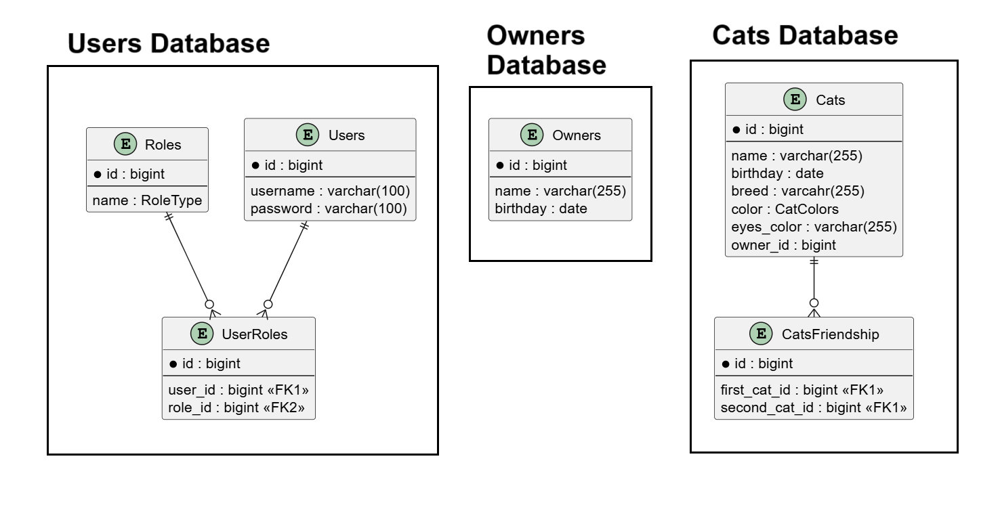
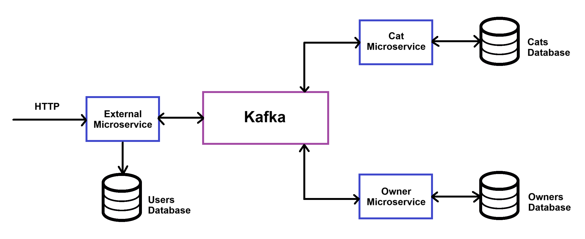

# Service for owners and their cats

Pet project - Async REST API to interact with owners and their cats.

### Technologies

* <b>Spring MVC</b>, <b>Spring Boot</b>
* <b>Spring Data JPA</b>: repositories
* <b>Spring Security</b> + <b>JWT</b>: all endpoints except login and user creation are secured. After successful login, the access token is stored in the cookies
* <b>Kafka</b> - message broker. Communication between 3 microservices. One microservice is external, receives requests, sends messages through the broker to two other microservices (for logic related to cats and owners), receives responses, and sends them in the required format. Each microservice has its own database
* Testing
  * integration tests using <b>Testcontainers</b> for repositories
  * <b>JUint5</b> and <b>Mockito</b> for services unit tests
  * <b>mockMvc</b> for controllers tests
* <b>Docker</b>, <b>Docker Compose</b>, <b>Flyway</b>: start database containers, broker(Kafka), microservices, pgAdmin, Kafka UI, Zookeeper, and apply migrations.
* <b>Swagger</b>: documentation
* <b>CI CD</b>: run tests

Databases:

Communication between microservices:

### Functional:

* User:
    * create (with Owner)
    * login 
    * logout

* Owner
  * get info
  * delete
  * get owners with several criteria (by name/birthday; only for admin)
  * delete all owners (only for admin)

* Cat
  * create
  * get info
  * get owners with several criteria (name/birthday/breed/color/eyes color). Admin will get all cats, owners only their cats
  * change owner
  * adding and removing cat to friends list
  * delete
  * delete all cats (only for admin)

### TODO

* Store and use refresh token

* Testing microservices communication with Testcontainers (Kafka)
